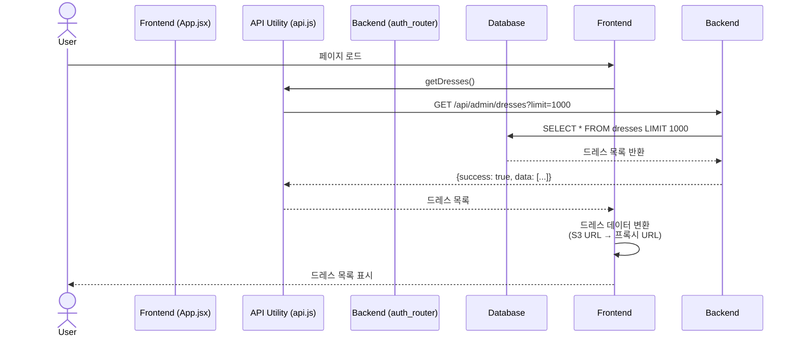
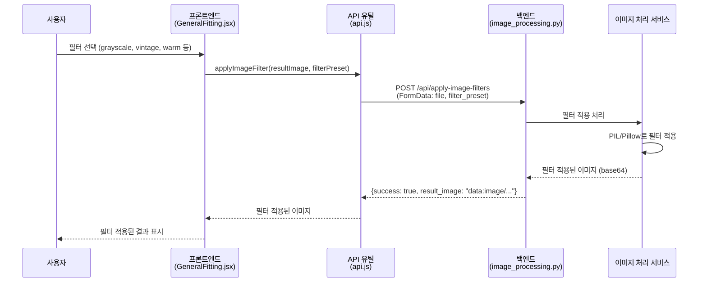
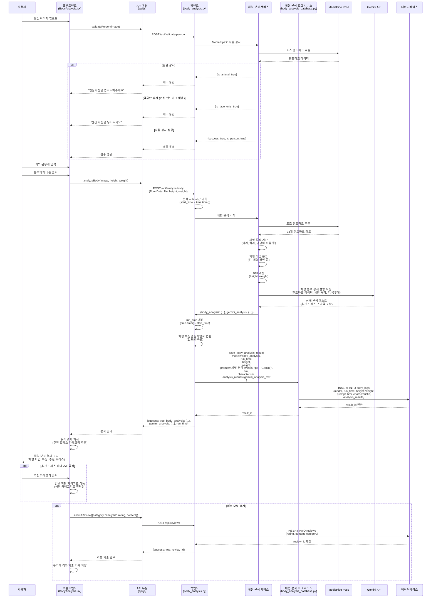
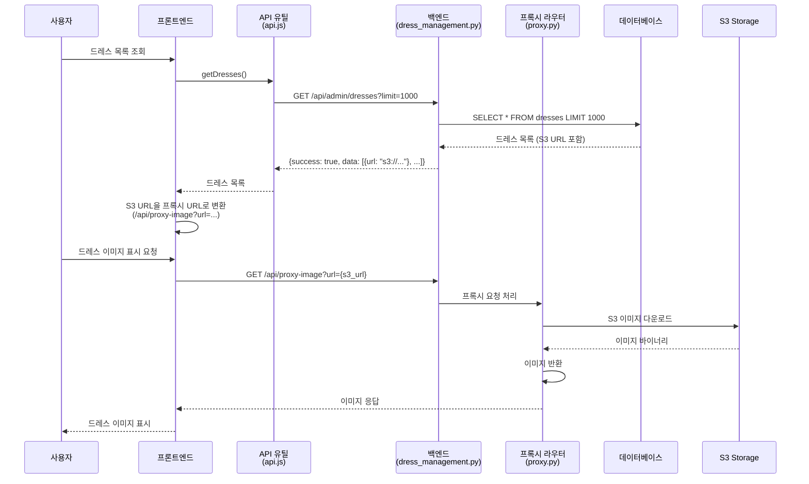
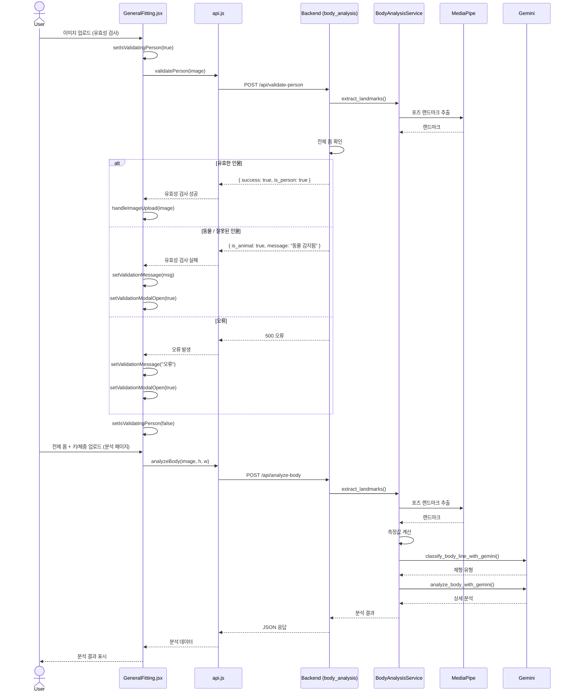
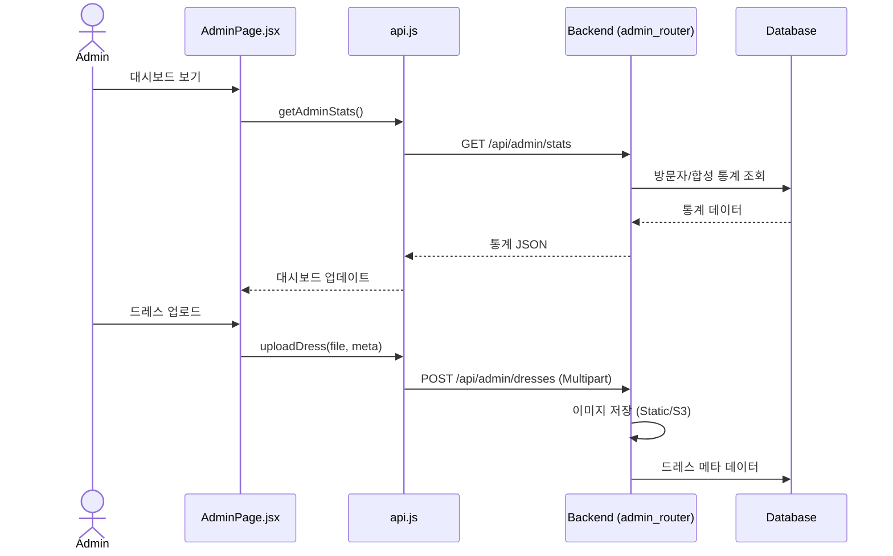
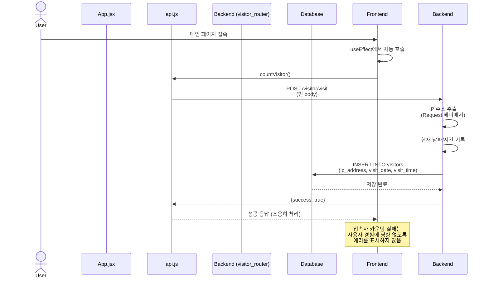
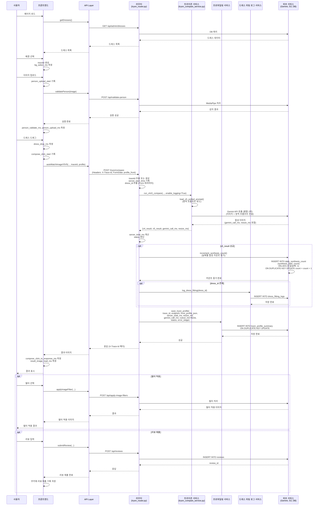

알겠습니다! `v4` 관련된 부분을 제거하고, `v5`를 중심으로 수정된 다이어그램을 한글로 정리한 내용입니다. 아래는 수정된 내용입니다.

---

## 1. 인증 (Authentication)

**엔드포인트**: `/api/auth/login`, `/api/auth/logout`, `/api/auth/verify`



### 1.2 일반 피팅 전체 플로우 (로깅 포함)

```mermaid
sequenceDiagram
    participant User as 사용자
    participant Frontend as 프론트엔드<br/>(GeneralFitting.jsx)
    participant API as API 유틸<br/>(api.js)
    participant Backend as 백엔드<br/>(tryon_router.py)
    participant BodyService as 체형 분석 서비스
    participant TryonService as 트라이온 서비스<br/>(tryon_compare_service.py)
    participant ProfileService as 프로파일링 서비스<br/>(profile_service.py)
    participant DressLogService as 드레스 피팅 로그 서비스
    participant Gemini as Gemini API
    participant DB as 데이터베이스

    User->>Frontend: 배경 선택
    Frontend->>Frontend: traceId 생성<br/>(trace_${Date.now()}_${random})
    Frontend->>Frontend: bg_select_start = Date.now()
    Frontend->>Frontend: bg_select_ms 측정 완료
    
    User->>Frontend: 전신 이미지 업로드
    Frontend->>Frontend: person_upload_start = Date.now()
    Frontend->>API: validatePerson(image)
    API->>Backend: POST /api/validate-person
    Backend->>BodyService: MediaPipe로 사람 감지
    BodyService-->>Backend: {success: true, is_person: true}
    Backend-->>API: 검증 결과
    API-->>Frontend: 검증 성공
    Frontend->>Frontend: person_validate_ms 측정 완료
    Frontend->>Frontend: person_upload_ms 측정 완료
    
    User->>Frontend: 드레스 드래그 앤 드롭
    Frontend->>Frontend: dress_drop_ms 측정 시작
    Frontend->>API: autoMatchImageV5V5(person, dress, background, traceId, profile)
    Note over Frontend,API: profile에 타이밍 정보 포함<br/>(bg_select_ms, person_upload_ms,<br/>person_validate_ms, dress_drop_ms)
    
    API->>Backend: POST /tryon/compare<br/>(FormData: person_image, garment_image,<br/>background_image, profile_front,<br/>dress_id (선택사항),<br/>Headers: X-Trace-Id)
    Backend->>Backend: traceId 추출 또는 생성<br/>server_start_time 기록
    Backend->>Backend: front_profile_json 파싱<br/>dress_id 추출 (Form 파라미터)
    
    alt 입력 검증 실패
        Backend->>Backend: server_total_ms 계산
        Backend->>ProfileService: save_tryon_profile(<br/>  status="fail",<br/>  error_stage="input_validation"<br/>)
        Backend-->>API: 400 에러 응답
        API-->>Frontend: 에러 메시지
    else 입력 검증 성공
        Backend->>TryonService: run_v4v5_compare(person, garment, background, enable_logging=True)
    TryonService->>TryonService: V5 파이프라인 병렬 실행 (2회)
    
    par V5-1 실행
        TryonService->>TryonService: load_v5_unified_prompt()<br/>(prompts/v5/prompt_unified.txt<br/>에서 정적 프롬프트 로드)
        TryonService->>Gemini: 이미지 합성 요청<br/>(person_img, garment_img, background_img,<br/>정적 프롬프트 포함,<br/>temperature=0.0, safety_settings=BLOCK_NONE)
        Gemini-->>TryonService: 합성 이미지 (base64)<br/>gemini_call_ms 포함
    and V5-2 실행
        TryonService->>TryonService: load_v5_unified_prompt()<br/>(prompts/v5/prompt_unified.txt<br/>에서 정적 프롬프트 로드)
        TryonService->>Gemini: 이미지 합성 요청<br/>(person_img, garment_img, background_img,<br/>정적 프롬프트 포함,<br/>temperature=0.0, safety_settings=BLOCK_NONE)
        Gemini-->>TryonService: 합성 이미지 (base64)<br/>gemini_call_ms 포함
    end
    
    TryonService->>TryonService: resize_ms, gemini_call_ms 수집
    TryonService-->>Backend: {v4_result: {...}, v5_result: {...},<br/>gemini_call_ms, resize_ms}
    
    Backend->>Backend: server_total_ms 계산<br/>(time.time() - server_start_time) * 1000
    Backend->>Backend: status 판단<br/>(result.success 여부)
    
    opt v5_result가 성공한 경우
        Backend->>Backend: increment_synthesis_count()<br/>(날짜별 합성 카운트 증가)
        Backend->>DB: INSERT INTO daily_synthesis_count<br/>(synthesis_date, count)<br/>VALUES (오늘날짜, 1)<br/>ON DUPLICATE KEY UPDATE count = count + 1
        DB-->>Backend: 카운트 증가 완료
        
        opt dress_id가 있는 경우
            Backend->>DressLogService: log_dress_fitting(dress_id)
            DressLogService->>DB: INSERT INTO dress_fitting_logs<br/>(dress_id)
            DB-->>DressLogService: 저장 완료
            DressLogService-->>Backend: 성공
        end
    end
    
    Backend->>ProfileService: save_tryon_profile(<br/>  trace_id,<br/>  endpoint="/tryon/compare",<br/>  front_profile_json,<br/>  server_total_ms,<br/>  resize_ms,<br/>  gemini_call_ms,<br/>  cutout_ms=None,<br/>  status,<br/>  error_stage<br/>)
    ProfileService->>ProfileService: ensure_table_exists()<br/>(테이블 자동 생성)
    ProfileService->>DB: INSERT INTO tryon_profile_summary<br/>(trace_id, endpoint, front_profile_json,<br/>server_total_ms, resize_ms, gemini_call_ms,<br/>cutout_ms, status, error_stage)<br/>ON DUPLICATE KEY UPDATE
    DB-->>ProfileService: 저장 완료
    ProfileService-->>Backend: 성공
    
    alt 예외 발생
        Backend->>Backend: server_total_ms 계산
        Backend->>ProfileService: save_tryon_profile(<br/>  status="fail",<br/>  error_stage="exception"<br/>)
        Backend-->>API: 500 에러 응답
        API-->>Frontend: 에러 메시지
    else 정상 처리
        Backend-->>API: V4V5CompareResponse<br/>(Headers: X-Trace-Id)
        API-->>Frontend: 결과 이미지 (v4_result, v5_result)
    end
    
    Frontend->>Frontend: result_image_load_start = Date.now()
    Frontend->>Frontend: 이미지 선택 모달 표시<br/>(2개 이미지가 있는 경우)
    User->>Frontend: 결과 이미지 선택
    Frontend->>Frontend: result_image_load_ms 측정 완료
    Frontend-->>User: 선택한 이미지 표시
    
    opt 리뷰 모달 표시 (쿠키 확인 후)
        Frontend->>Frontend: 3초 후 리뷰 모달 표시
        User->>Frontend: 리뷰 제출
        Frontend->>API: submitReview({category: 'general', rating, content})
        API->>Backend: POST /api/reviews
        Backend->>DB: INSERT INTO reviews<br/>(rating, content, category)
        DB-->>Backend: review_id 반환
        Backend-->>API: {success: true, review_id}
        API-->>Frontend: 리뷰 제출 완료
        Frontend->>Frontend: 쿠키에 리뷰 제출 기록 저장
    end
```

### 1.3 이미지 필터 적용



## 2. 커스텀 피팅 (Custom Fitting)

### 2.1 커스텀 피팅 전체 플로우 (로깅 포함)

```mermaid
sequenceDiagram
    participant User as 사용자
    participant Frontend as 프론트엔드<br/>(CustomFitting.jsx)
    participant API as API 유틸<br/>(api.js)
    participant Backend as 백엔드<br/>(custom_v4v5_router.py)
    participant BodyService as 체형 분석 서비스
    participant DressService as 드레스 체크 서비스
    participant CustomTryonService as 커스텀 트라이온 서비스<br/>(custom_v4v5_compare_service.py)
    participant ProfileService as 프로파일링 서비스<br/>(profile_service.py)
    participant LogService as 로그 서비스<br/>(log_service.py)
    participant SegformerService as SegFormer 서비스
    participant Gemini as Gemini API
    participant S3 as S3 Storage
    participant DB as 데이터베이스

    User->>Frontend: 배경 선택
    Frontend->>Frontend: traceId 생성<br/>(trace_${Date.now()}_${random})
    Frontend->>Frontend: bg_select_start = Date.now()
    Frontend->>Frontend: bg_select_ms 측정 완료
    
    User->>Frontend: 전신 이미지 업로드
    Frontend->>Frontend: person_upload_start = Date.now()
    Frontend->>API: validatePerson(image)
    API->>Backend: POST /api/validate-person
    Backend->>BodyService: MediaPipe로 사람 감지
    BodyService-->>Backend: {success: true, is_person: true}
    Backend-->>API: 검증 결과
    API-->>Frontend: 검증 성공
    Frontend->>Frontend: person_validate_ms 측정 완료
    Frontend->>Frontend: person_upload_ms 측정 완료
    
    User->>Frontend: 드레스 이미지 업로드
    Frontend->>Frontend: dress_upload_start = Date.now()
    Frontend->>API: checkDress(dressImage)
    API->>Backend: POST /api/dress/check<br/>(FormData: file, model, mode)
    Backend->>DressService: GPT-4o-mini로 드레스 체크
    DressService->>DressService: 이미지 분석 및 드레스 여부 판단
    DressService-->>Backend: {success: true, result: {dress: true}}
    Backend-->>API: 드레스 체크 결과
    API-->>Frontend: {success: true, result: {dress: true}}
    Frontend->>Frontend: dress_validate_ms 측정 완료
    Frontend->>Frontend: dress_upload_ms 측정 완료
    
    alt 드레스가 아닌 경우
        Frontend->>Frontend: 에러 모달 표시
        Frontend-->>User: "드레스 사진을 넣어주세요"
    end
    
    User->>Frontend: 매칭하기 버튼 클릭
    Frontend->>Frontend: compose_click_start = Date.now()
    Frontend->>API: customV5V5MatchImage(fullBody, dress, background, traceId, profile)
    Note over Frontend,API: profile에 타이밍 정보 포함<br/>(bg_select_ms, person_upload_ms,<br/>person_validate_ms, dress_upload_ms,<br/>dress_validate_ms)
    
    API->>Backend: POST /tryon/compare/custom<br/>(FormData: person_image, garment_image,<br/>background_image, profile_front,<br/>Headers: X-Trace-Id)
    Backend->>Backend: traceId 추출 또는 생성<br/>server_start_time 기록
    Backend->>Backend: front_profile_json 파싱
    
    alt 입력 검증 실패
        Backend->>Backend: server_total_ms 계산
        Backend->>ProfileService: save_tryon_profile(<br/>  status="fail",<br/>  error_stage="input_validation"<br/>)
        Backend-->>API: 400 에러 응답
        API-->>Frontend: 에러 메시지
    else 입력 검증 성공
        Backend->>CustomTryonService: run_v4v5_custom_compare(person, garment, background, enable_logging=True)
    CustomTryonService->>CustomTryonService: 의상 이미지 S3 업로드<br/>(로깅용)
    CustomTryonService->>S3: upload_log_to_s3(garment_image, "custom-fitting", "garment")
    S3-->>CustomTryonService: garment_s3_url
    
    CustomTryonService->>CustomTryonService: V5 파이프라인 병렬 실행 (2회)
    
    par CustomV5-1 실행
        CustomTryonService->>SegformerService: 의상 누끼 처리 (배경 제거)
        SegformerService-->>CustomTryonService: 누끼 처리된 의상 이미지<br/>cutout_ms 포함
        CustomTryonService->>CustomTryonService: load_v5_unified_prompt()<br/>(prompts/v5/prompt_unified.txt<br/>에서 정적 프롬프트 로드)
        CustomTryonService->>Gemini: 이미지 합성 요청<br/>(person_img, garment_nukki_img,<br/>background_img, 정적 프롬프트 포함,<br/>temperature=0.0, safety_settings=BLOCK_NONE)
        Gemini-->>CustomTryonService: 합성 이미지 (base64)<br/>gemini_call_ms 포함
    and CustomV5-2 실행
        CustomTryonService->>SegformerService: 의상 누끼 처리 (배경 제거)
        SegformerService-->>CustomTryonService: 누끼 처리된 의상 이미지<br/>cutout_ms 포함
        CustomTryonService->>CustomTryonService: load_v5_unified_prompt()<br/>(prompts/v5/prompt_unified.txt<br/>에서 정적 프롬프트 로드)
        CustomTryonService->>Gemini: 이미지 합성 요청<br/>(person_img, garment_nukki_img,<br/>background_img, 정적 프롬프트 포함,<br/>temperature=0.0, safety_settings=BLOCK_NONE)
        Gemini-->>CustomTryonService: 합성 이미지 (base64)<br/>gemini_call_ms 포함
    end
    
    CustomTryonService->>CustomTryonService: total_time 계산<br/>cutout_ms, gemini_call_ms, resize_ms 수집
    
    opt enable_logging == True && garment_s3_url 존재
        CustomTryonService->>LogService: save_custom_fitting_log(<br/>  dress_url=garment_s3_url,<br/>  run_time=total_time<br/>)
        LogService->>DB: INSERT INTO result_logs<br/>(person_url="", dress_url, result_url="",<br/>model="custom-fitting", prompt="",<br/>success=True, run_time)
        DB-->>LogService: 저장 완료
        LogService-->>CustomTryonService: 성공
    end
    
    CustomTryonService-->>Backend: {v4_result: {...}, v5_result: {...},<br/>cutout_ms, gemini_call_ms, resize_ms}
    
    Backend->>Backend: server_total_ms 계산<br/>(time.time() - server_start_time) * 1000
    Backend->>Backend: cutout_ms, gemini_call_ms, resize_ms 추출<br/>status 판단
    
    opt v5_result가 성공한 경우
        Backend->>Backend: increment_synthesis_count()<br/>(날짜별 합성 카운트 증가)
        Backend->>DB: INSERT INTO daily_synthesis_count<br/>(synthesis_date, count)<br/>VALUES (오늘날짜, 1)<br/>ON DUPLICATE KEY UPDATE count = count + 1
        DB-->>Backend: 카운트 증가 완료
    end
    
    Backend->>ProfileService: save_tryon_profile(<br/>  trace_id,<br/>  endpoint="/tryon/compare/custom",<br/>  front_profile_json,<br/>  server_total_ms,<br/>  resize_ms,<br/>  gemini_call_ms,<br/>  cutout_ms,<br/>  status,<br/>  error_stage<br/>)
    ProfileService->>ProfileService: ensure_table_exists()<br/>(테이블 자동 생성)
    ProfileService->>DB: INSERT INTO tryon_profile_summary<br/>(trace_id, endpoint, front_profile_json,<br/>server_total_ms, resize_ms, gemini_call_ms,<br/>cutout_ms, status, error_stage)<br/>ON DUPLICATE KEY UPDATE
    DB-->>ProfileService: 저장 완료
    ProfileService-->>Backend: 성공
    
    alt 예외 발생
        Backend->>Backend: server_total_ms 계산
        Backend->>ProfileService: save_tryon_profile(<br/>  status="fail",<br/>  error_stage="exception"<br/>)
        Backend-->>API: 500 에러 응답
        API-->>Frontend: 에러 메시지
    else 정상 처리
        Backend-->>API: V4V5CustomCompareResponse<br/>(Headers: X-Trace-Id)
        API-->>Frontend: 결과 이미지 (v4_result, v5_result)
    end
    Frontend->>Frontend: compose_click_to_response_ms 측정 완료
    
    Frontend->>Frontend: result_image_load_start = Date.now()
    Frontend->>Frontend: 이미지 선택 모달 표시<br/>(2개 이미지가 있는 경우)
    User->>Frontend: 결과 이미지 선택
    Frontend->>Frontend: result_image_load_ms 측정 완료
    Frontend-->>User: 선택한 이미지 표시
    
    opt 리뷰 모달 표시
        Frontend->>API: submitReview({category: 'custom', rating, content})
        API->>Backend: POST /api/reviews
        Backend->>DB: INSERT INTO reviews<br/>(rating, content, category)
        DB-->>Backend: review_id 반환
        Backend-->>API: {success: true, review_id}
        API-->>Frontend: 리뷰 제출 완료
        Frontend->>Frontend: 쿠키에 리뷰 제출 기록 저장
    end
```

---

### 2.2 Custom Match V5V5

### 3.1 체형 분석 전체 플로우 (로깅 포함)



## 4. 드레스 관리

### 4.1 드레스 목록 조회 및 프록시



### 4.2 드레스 체크 (커스텀 피팅용)



---

## 4. 관리자 및 관리 (Admin & Management)

**엔드포인트**: `/api/admin/dresses`, `/api/admin/stats`, `/api/admin/logs`
**프론트엔드**: `AdminPage.jsx` (예시)




삽입
DB-->>BE: 드레스 ID
BE-->>API: 성공 응답
API-->>Page: 성공 토스트 표시

```
Admin->>Page: 체형 분석 로그 보기
Page->>API: getBodyAnalysisLogs()
API->>BE: GET /api/admin/body-logs
BE->>DB: 로그 조회
DB-->>BE: 로그 목록
BE-->>API: 로그 JSON
API-->>Page: 로그 테이블 렌더링
```

````

---

## 5. 드레스 관리 (Dress Management)
**엔드포인트**: `/api/dress/check`
**프론트엔드**: `CustomFitting.jsx`, `api.js`

```mermaid
sequenceDiagram
    actor User
    participant Page as CustomFitting.jsx
    participant API as api.js
    participant BE as Backend (dress_management)
    participant AI as External AI (GPT-4o-mini)

    User->>Page: 드레스 이미지 업로드
    Page->>Page: handleDressFile()
    Page->>Page: setIsCheckingDress(true)
    Page->>API: checkDress(image)
    API->>BE: POST /api/dress/check
    BE->>AI: 이미지 분석 (드레스 여부 확인)
    AI-->>BE: 분석 결과
    BE-->>API: JSON 응답 (is_dress)
    API-->>Page: 결과 확인
    
    alt 드레스
        Page->>Page: setDressCheckResult(true)
    else 드레스 아님
        Page->>Page: setErrorMessage("드레스 아님")
        Page->>Page: setErrorModalOpen(true)
    end
    Page->>Page: setIsCheckingDress(false)
````

---

## 6. 리뷰 시스템 (Review System)

**엔드포인트**: `/api/reviews`
**프론트엔드**: `ReviewModal.jsx`

```mermaid
sequenceDiagram
    actor User
    participant Modal as ReviewModal.jsx
    participant API as api.js
    participant BE as Backend (review_router)
    participant DB as Database

    User->>Modal: 리뷰 제출 (평점, 내용)
    Modal->>API: submitReview(data)
    API->>BE: POST /api/reviews
    BE->>DB: 리뷰 삽입
    DB-->>BE: 성공
    BE-->>API: 200 OK
    API-->>Modal: 성공
    Modal->>Modal: 모달 닫고 쿠키 설정

    User->>Modal: 리뷰 보기
    Modal->>API: getReviews()
    API->>BE: GET /api/reviews
    BE->>DB: 리뷰 조회
    DB-->>BE: 리뷰 목록
    BE-->>API: 리뷰 JSON
    API-->>Modal: 리뷰 렌더링
```

---

## 7. 방문자 추적 (Visitor Tracking)

**엔드포인트**: `/visitor/visit`, `/visitor/today`
**프론트엔드**: `App.jsx`, `api.js`



## 9. 프로파일링 시스템

### 9.1 트라이온 프로파일링 데이터 수집 (로깅 포함)


## 10. 통합 플로우: 일반 피팅 완전한 시퀀스 (로깅 포함)



