# 시스템 시퀀스 다이어그램

이 문서는 백엔드와 프론트엔드 간의 주요 기능별 상세 시퀀스 다이어그램을 포함합니다.

## 1. 일반 피팅 (General Fitting)

### 1.1 드레스 목록 조회

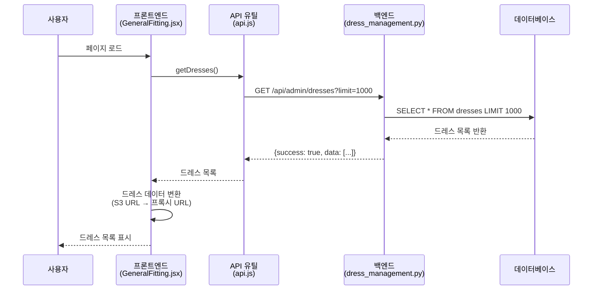

### 1.2 일반 피팅 전체 플로우 (로깅 포함)

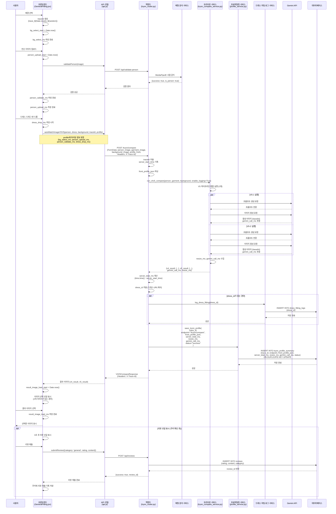

### 1.3 이미지 필터 적용

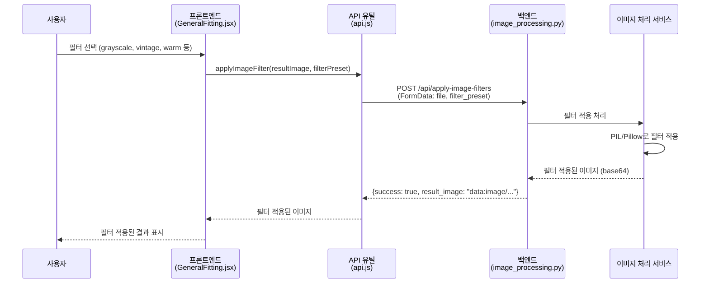

## 2. 커스텀 피팅 (Custom Fitting)

### 2.1 커스텀 피팅 전체 플로우 (로깅 포함)

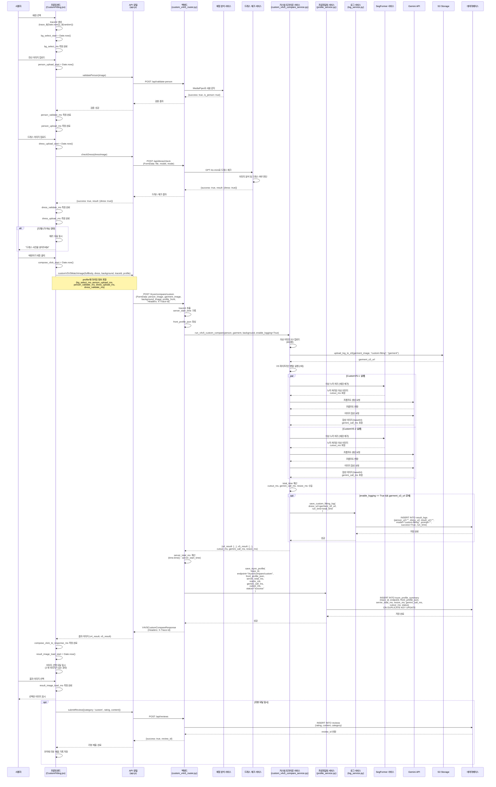

## 3. 체형 분석 (Body Analysis)

### 3.1 체형 분석 전체 플로우 (로깅 포함)

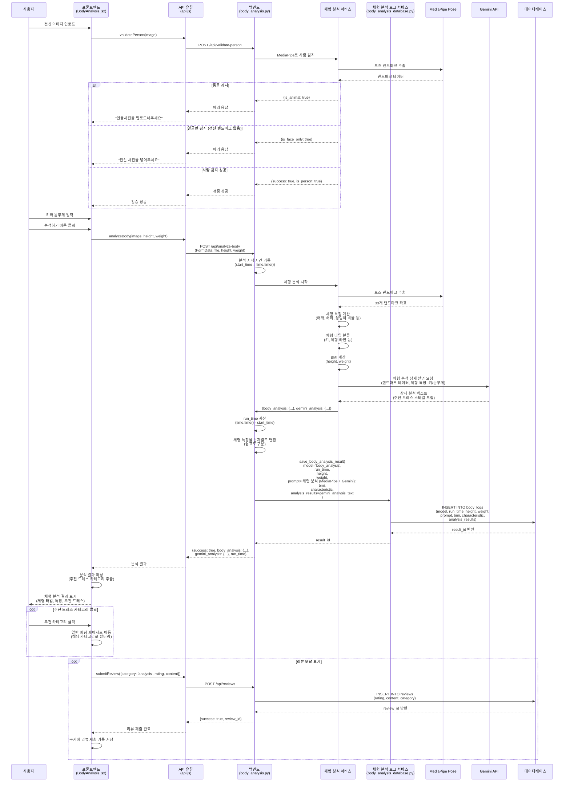

## 4. 드레스 관리

### 4.1 드레스 목록 조회 및 프록시

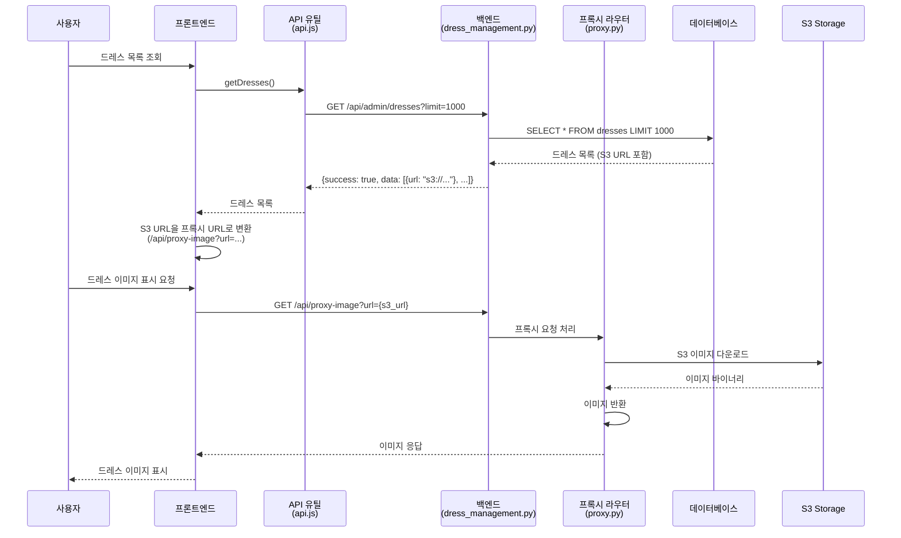

### 4.2 드레스 체크 (커스텀 피팅용)

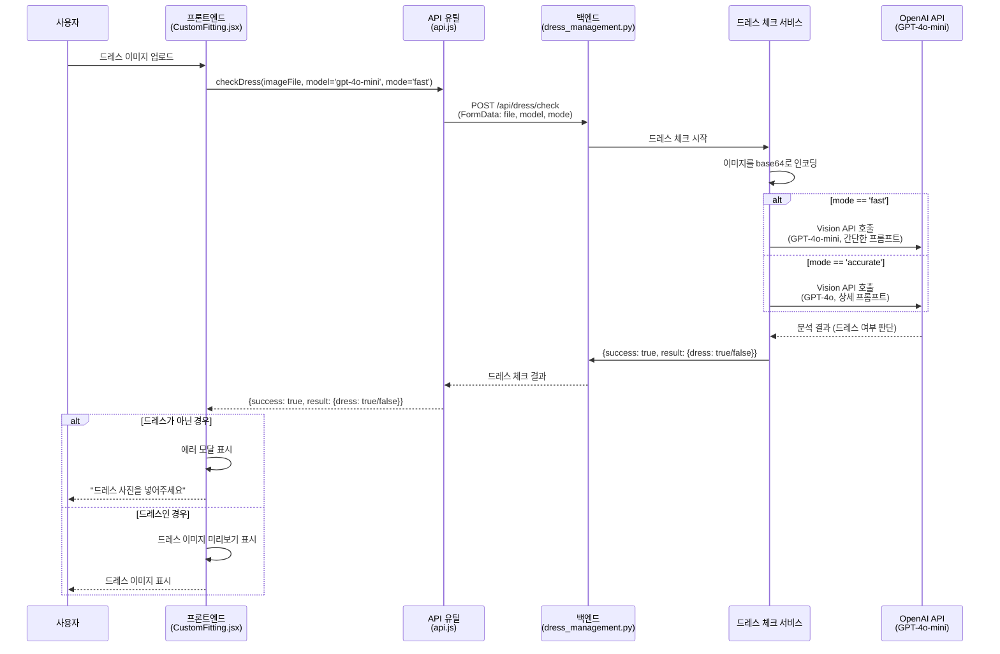

## 5. 리뷰 시스템

### 5.1 리뷰 제출

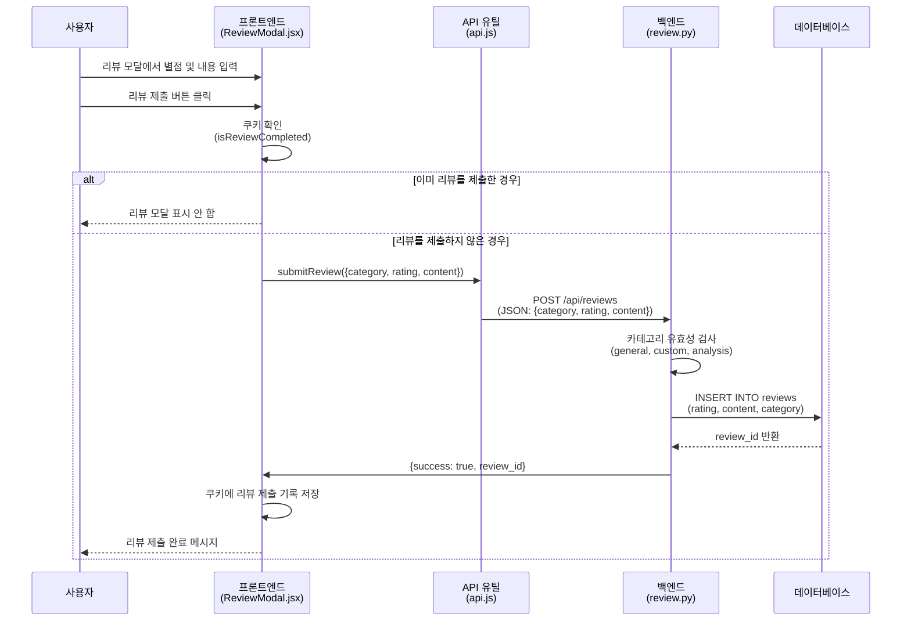

### 5.2 리뷰 조회

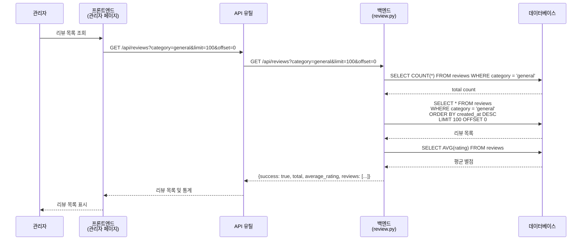

## 6. 인증 시스템

### 6.1 관리자 로그인

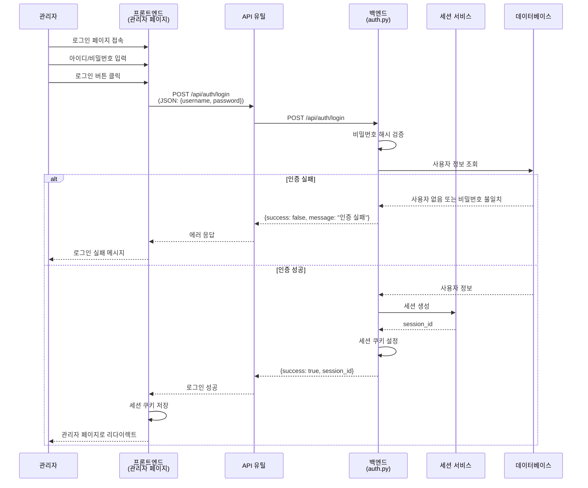

### 6.2 인증 검증

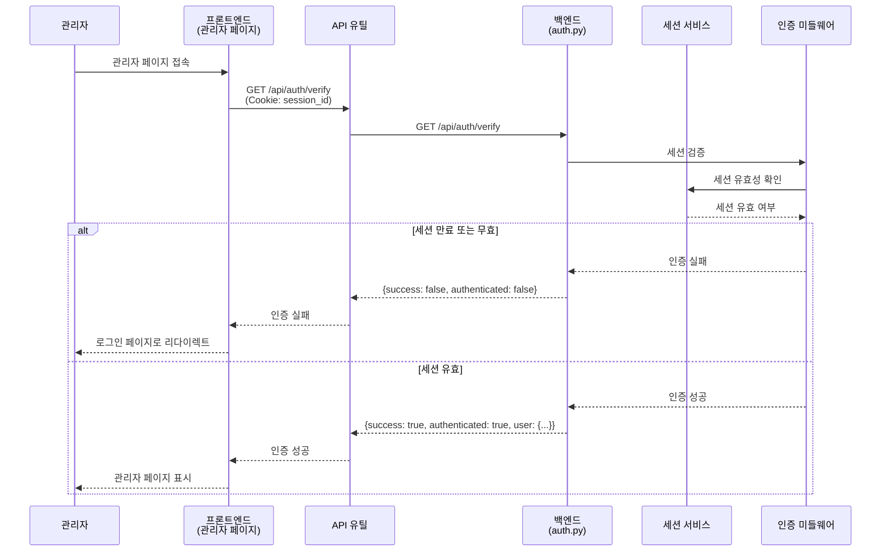

## 7. 이미지 처리

### 7.1 이미지 프록시 (CORS 해결)

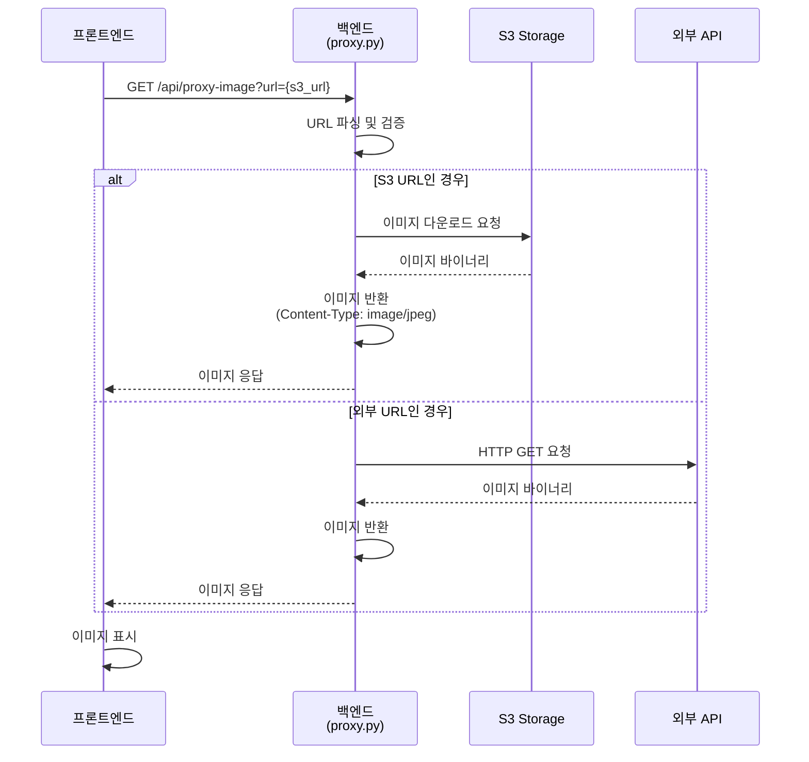

### 7.2 이미지 필터 적용

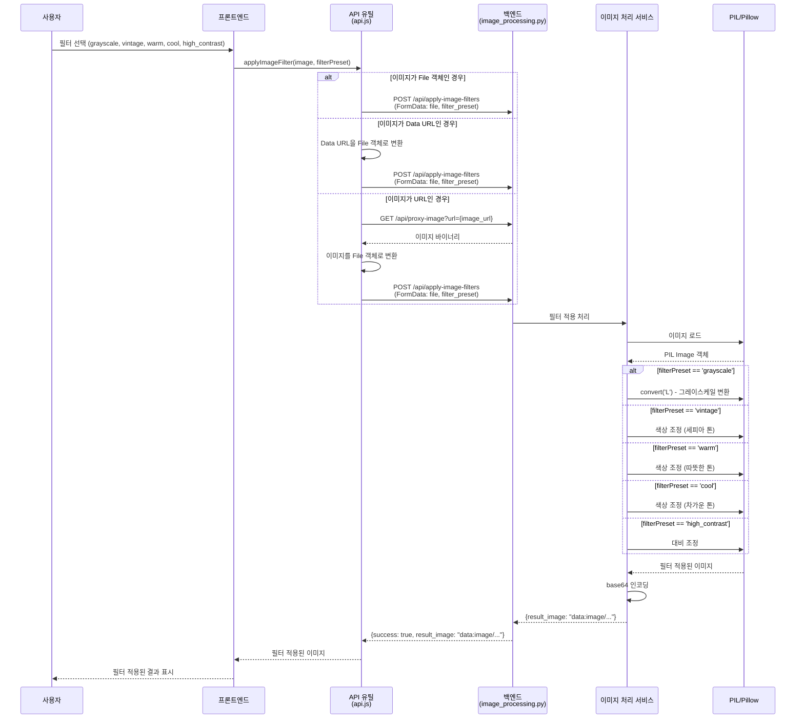

## 8. 접속자 통계

### 8.1 접속자 카운팅

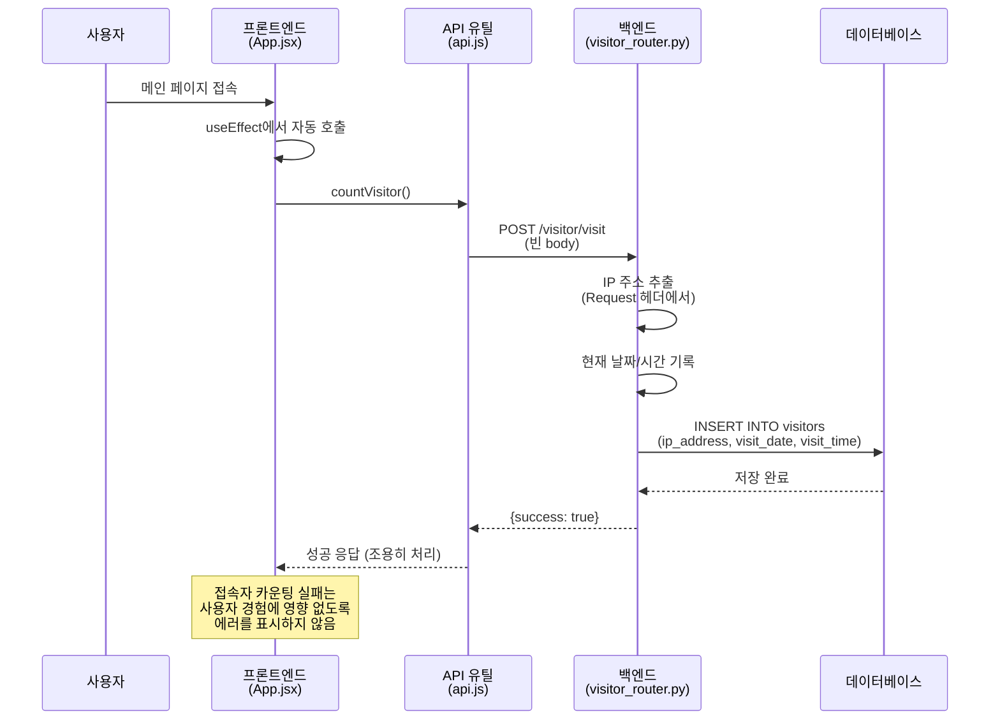

## 9. 프로파일링 시스템

### 9.1 트라이온 프로파일링 데이터 수집 (로깅 포함)

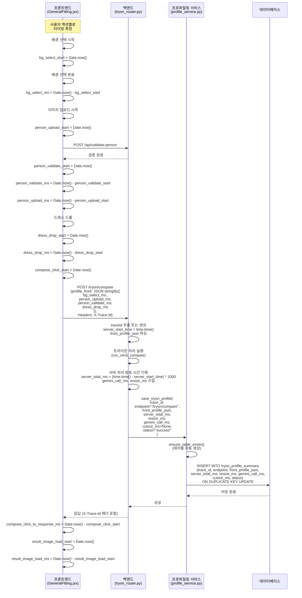

## 10. 통합 플로우: 일반 피팅 완전한 시퀀스 (로깅 포함)

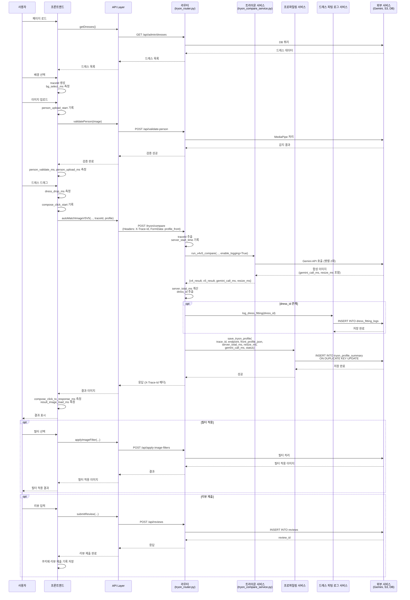

